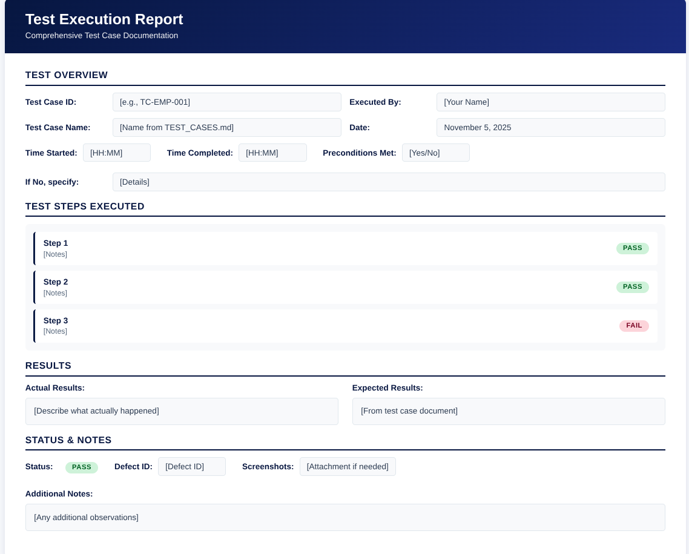
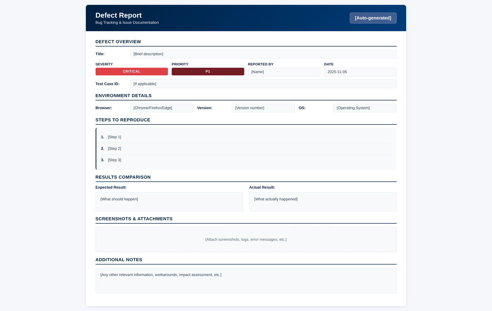

# UAT Execution Guide
## Travelling and Subsistence (T&S) Allowance Application System

**Document Version:** 1.0  
**Date:** November 5, 2025  
**Document by:** Tinashe Ephraim Nyoni

---

## Table of Contents.

1. [Overview](#overview)
2. [For UAT Panelists](#for-uat-panelists)
3. [For Development Team](#for-development-team)
4. [Test Execution Process](#test-execution-process)
5. [Defect Reporting](#defect-reporting)
6. [UAT Reporting](#uat-reporting)
7. [Best Practices](#best-practices)
8. [FAQs](#faqs)

---

## 1. Overview

This guide provides step-by-step instructions for executing User Acceptance Testing (UAT) for the T&S Allowance Application System. It is designed for both UAT panelists and the development team to ensure a smooth and effective testing process.

---

## 2. For UAT Panelists

### 2.1 Getting Started

#### Step 1: Access Test Environment
1. Obtain test environment URL from UAT Coordinator
2. Open web browser (Chrome, Firefox, or Edge)
3. Navigate to test environment URL
4. Verify you can access the login page

#### Step 2: Obtain Test Credentials
1. Contact UAT Coordinator for test account credentials
2. You will receive:
   - Employee account credentials (if testing as Employee)
   - Supervisor account credentials (if testing as Supervisor)
3. Store credentials securely

#### Step 3: Review Documentation
Before starting testing, review:
- ✅ UAT Plan (UAT_PLAN.md)
- ✅ Test Cases (TEST_CASES.md)
- ✅ Test Data Guide (TEST_DATA_GUIDE.md)
- ✅ This Execution Guide

### 2.2 Test Execution Workflow

#### Daily Testing Process

1. **Morning Check-in**
   - Log in to test environment
   - Verify environment is accessible
   - Check for any announcements or updates

2. **Select Test Cases**
   - Review test cases assigned for the day
   - Start with high priority test cases
   - Follow test case sequence in TEST_CASES.md

3. **Execute Test Cases**
   - Follow test steps exactly as documented
   - Record actual results
   - Take screenshots if issues found
   - Document any deviations

4. **Report Results**
   - Update test case execution status
   - Report defects if any found
   - Update test execution log

5. **End of Day**
   - Complete test case execution log
   - Submit defect reports
   - Update progress with UAT Coordinator

### 2.3 Test Case Execution Steps

#### For Each Test Case:

1. **Read Test Case**
   - Review test objective
   - Understand expected results
   - Check preconditions

2. **Prepare Test Environment**
   - Ensure preconditions are met
   - Have test data ready
   - Clear browser cache if needed

3. **Execute Test Steps**
   - Follow steps sequentially
   - Perform each action carefully
   - Observe system behavior

4. **Verify Results**
   - Compare actual vs expected results
   - Check all acceptance criteria
   - Document any discrepancies

5. **Record Results**
   - Mark test case as Pass/Fail/Blocked
   - Add notes if needed
   - Link defect ID if test failed

### 2.4 Test Case Execution Template

Use the HTML template to record test execution. The template provides a professional, structured format for documenting test results.

**Access the Template:**
- **HTML Template:** [Test_Execution_Report_Template.html](Test_Execution_Report_Template.html) - Open in your web browser to use
- Fill in all required fields
- Save a copy for each test case you execute
- Print or export as PDF for submission

**Template Features:**
- Professional formatted layout
- Step-by-step test execution tracking
- Status badges (Pass/Fail/Blocked/Not Executed)
- Side-by-side comparison of Actual vs Expected results
- Fields for defect tracking and screenshots
- Print-friendly design

**Instructions:**
1. Open [Test_Execution_Report_Template.html](Test_Execution_Report_Template.html) in your web browser
2. Fill in the test case details (ID, Name, Date, etc.)
3. Document each test step with pass/fail status
4. Record actual results and compare with expected results
5. Mark overall status and attach any defect IDs or screenshots
6. Save the completed report (you can save the HTML file or print to PDF)

**Template Preview:**



*Figure: Test Execution Report Template - Preview of the HTML template showing the structure and layout for documenting test execution results.*

---

## 3. For Development Team

### 3.1 Pre-UAT Preparation

#### Before UAT Starts:

1. **Environment Setup**
   - ✅ Deploy latest build to test environment
   - ✅ Configure test database
   - ✅ Set up test user accounts
   - ✅ Populate test data
   - ✅ Verify environment accessibility

2. **Documentation Review**
   - ✅ Review all UAT documents
   - ✅ Ensure test cases are testable
   - ✅ Verify test data requirements can be met

3. **Communication Setup**
   - ✅ Establish communication channels
   - ✅ Set up defect tracking system
   - ✅ Schedule daily stand-up meetings

### 3.2 During UAT

#### Daily Responsibilities:

1. **Monitor Testing**
   - Check test execution progress
   - Review defect reports
   - Address environment issues

2. **Defect Management**
   - Triage defects (assign priority)
   - Fix defects according to priority
   - Update defect status
   - Deploy fixes to test environment

3. **Support UAT Panelists**
   - Answer questions
   - Provide clarifications
   - Resolve technical issues
   - Assist with test data setup

4. **Daily Stand-up**
   - Attend daily UAT meetings
   - Report defect resolution status
   - Discuss blockers
   - Plan next day activities

### 3.3 Defect Resolution Process

#### For Each Defect:

1. **Receive Defect Report**
   - Review defect details
   - Verify defect is reproducible
   - Assign priority (P1-P4)

2. **Fix Defect**
   - Investigate root cause
   - Implement fix
   - Unit test the fix
   - Code review (if applicable)

3. **Deploy Fix**
   - Deploy to test environment
   - Notify UAT Coordinator
   - Update defect status to "Fixed"

4. **Verification**
   - Wait for UAT panelist to retest
   - Confirm defect is resolved
   - Close defect if verified

---

## 4. Test Execution Process

### 4.1 Test Execution Phases

#### Phase 1: Smoke Testing (Day 1)
- Verify basic functionality works
- Test critical user paths
- Identify major blockers
- **Duration:** 1 day

#### Phase 2: Functional Testing (Days 2-4)
- Execute all functional test cases
- Test all user roles
- Verify all acceptance criteria
- **Duration:** 3 days

#### Phase 3: Defect Resolution (Days 5-7)
- Development team fixes defects
- UAT panelists retest fixed defects
- **Duration:** 3 days

#### Phase 4: Regression Testing (Days 8-9)
- Retest critical functionality
- Verify defect fixes don't break existing features
- **Duration:** 2 days

#### Phase 5: Sign-off (Day 10)
- Final review of test results
- UAT sign-off meeting
- **Duration:** 1 day

### 4.2 Test Execution Tracking

#### Daily Metrics:
- Number of test cases executed
- Number of test cases passed
- Number of test cases failed
- Number of defects reported
- Number of defects resolved

#### Weekly Summary:
- Test execution progress (%)
- Defect summary (by priority)
- Blockers and issues
- Next week plan

---

## 5. Defect Reporting

### 5.1 Defect Reporting Template

Use the HTML template to report defects. The template provides a structured format for documenting bugs and issues.

**Access the Template:**
- **HTML Template:** [Defect_Reporting.html](Defect_Reporting.html) - Open in your web browser to use
- Fill in all required fields
- Save a copy for each defect reported
- Print or export as PDF for submission

**Template Features:**
- Professional formatted layout
- Defect overview with severity and priority indicators
- Environment details section
- Step-by-step reproduction instructions
- Side-by-side comparison of Expected vs Actual results
- Screenshots and attachments section
- Additional notes field
- Print-friendly design

**Instructions:**
1. Open [Defect_Reporting.html](Defect_Reporting.html) in your web browser
2. Fill in the defect details (Title, Severity, Priority, etc.)
3. Document the environment where the defect was found
4. Provide clear steps to reproduce the issue
5. Compare expected vs actual results
6. Attach screenshots or logs if available
7. Add any additional relevant information
8. Save the completed report (you can save the HTML file or print to PDF)

**Template Preview:**



*Figure: Defect Reporting Template - Preview of the HTML template showing the structure and layout for documenting defects and bugs.*

### 5.2 Defect Severity Guidelines

**Critical (P1):**
- System crash or data loss
- Security vulnerability
- Calculation errors
- Cannot proceed with testing

**High (P2):**
- Major functionality not working
- Workflow blocked
- Missing critical feature

**Medium (P3):**
- Minor functionality issue
- Workaround available
- UI/UX issues

**Low (P4):**
- Cosmetic issues
- Minor improvements
- Documentation issues

### 5.3 Defect Reporting Channels

- **Defect Tracking System:** [URL/System Name]
- **Email:** [UAT Coordinator Email]
- **Daily Stand-up:** Report during daily meetings

---

## 6. UAT Reporting

### 6.1 Daily Test Execution Report

**Template:**

```
UAT Daily Report - November 5, 2025

Test Execution Summary:
- Test Cases Executed: [Number]
- Test Cases Passed: [Number]
- Test Cases Failed: [Number]
- Test Cases Blocked: [Number]
- Progress: [Percentage]%

Defect Summary:
- New Defects: [Number]
- Defects Resolved: [Number]
- Open Defects: [Number]
  - P1: [Number]
  - P2: [Number]
  - P3: [Number]
  - P4: [Number]

Blockers:
- [List any blockers]

Next Day Plan:
- [Planned activities]
```

### 6.2 UAT Final Report

**Contents:**
1. Executive Summary
2. Test Execution Summary
3. Acceptance Criteria Status
4. Defect Summary
5. Recommendations
6. Sign-off Status

---

## 7. Best Practices

### 7.1 For UAT Panelists

- ✅ **Test Realistically:** Test as you would use the system in production
- ✅ **Document Everything:** Record all observations, even minor issues
- ✅ **Follow Test Cases:** Execute test cases as documented
- ✅ **Report Issues Promptly:** Don't wait to report defects
- ✅ **Communicate:** Ask questions if unclear about requirements
- ✅ **Be Thorough:** Don't skip test steps
- ✅ **Take Screenshots:** Capture evidence of issues

### 7.2 For Development Team

- ✅ **Respond Quickly:** Address defects according to priority
- ✅ **Communicate Clearly:** Explain fixes and changes
- ✅ **Test Before Deploying:** Verify fixes work before deploying
- ✅ **Provide Support:** Be available to help UAT panelists
- ✅ **Keep Environment Stable:** Minimize environment issues

---

## 8. FAQs

### 8.1 For UAT Panelists

**Q: What if I can't access the test environment?**  
A: Contact UAT Coordinator or Development Team immediately.

**Q: What if a test case is unclear?**  
A: Ask UAT Coordinator or Development Team for clarification.

**Q: What if I find a defect not in test cases?**  
A: Report it! Unexpected defects are valuable findings.

**Q: Can I test features not in requirements?**  
A: Focus on requirements first, but report any issues found.

**Q: What if test environment is down?**  
A: Report immediately. Testing will resume when environment is restored.

### 8.2 For Development Team

**Q: How quickly should P1 defects be fixed?**  
A: P1 defects should be fixed within 24 hours.

**Q: Can we deploy fixes during UAT hours?**  
A: Coordinate with UAT Coordinator. Avoid deploying during active testing if possible.

**Q: What if we can't reproduce a defect?**  
A: Contact the reporter for more details. If still not reproducible, mark as "Need More Info".

**Q: How do we handle test data issues?**  
A: Provide instructions or reset test data as needed.

---

## 9. Contact Information

**UAT Coordinator:**  
- Name: [Name]  
- Email: [Email]  
- Phone: [Phone]

**Development Team Lead:**  
- Name: [Name]  
- Email: [Email]  
- Phone: [Phone]

**Project Manager:**  
- Name: [Name]  
- Email: [Email]  
- Phone: [Phone]

---

## 10. Appendices

### Appendix A: Test Case Execution Log Template

[Excel/CSV template for tracking test execution]

### Appendix B: Defect Report Template

[Word/PDF template for defect reporting]

### Appendix C: Daily Stand-up Meeting Agenda

1. Test execution progress
2. Defects reported yesterday
3. Defects resolved yesterday
4. Blockers
5. Plan for today

---

**End of UAT Execution Guide**

